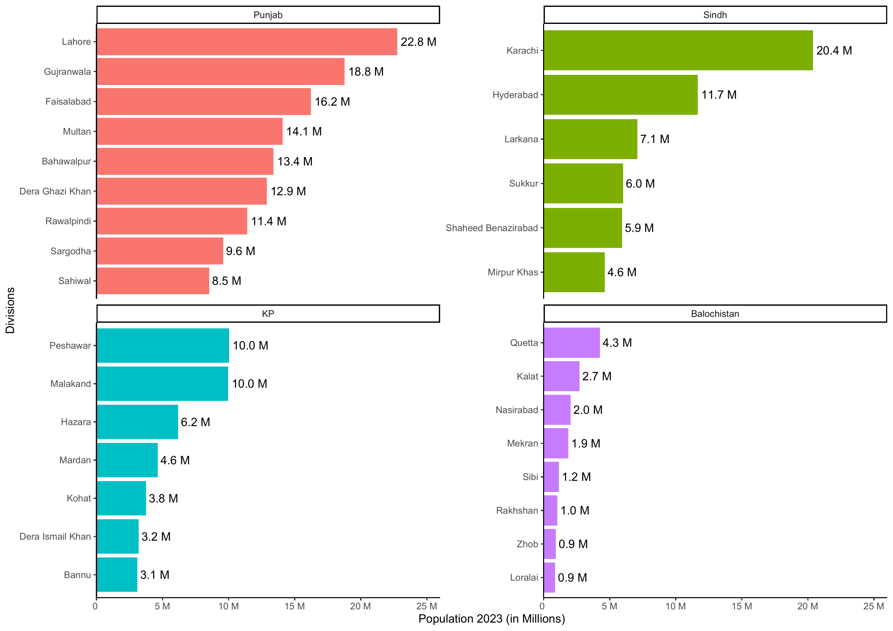
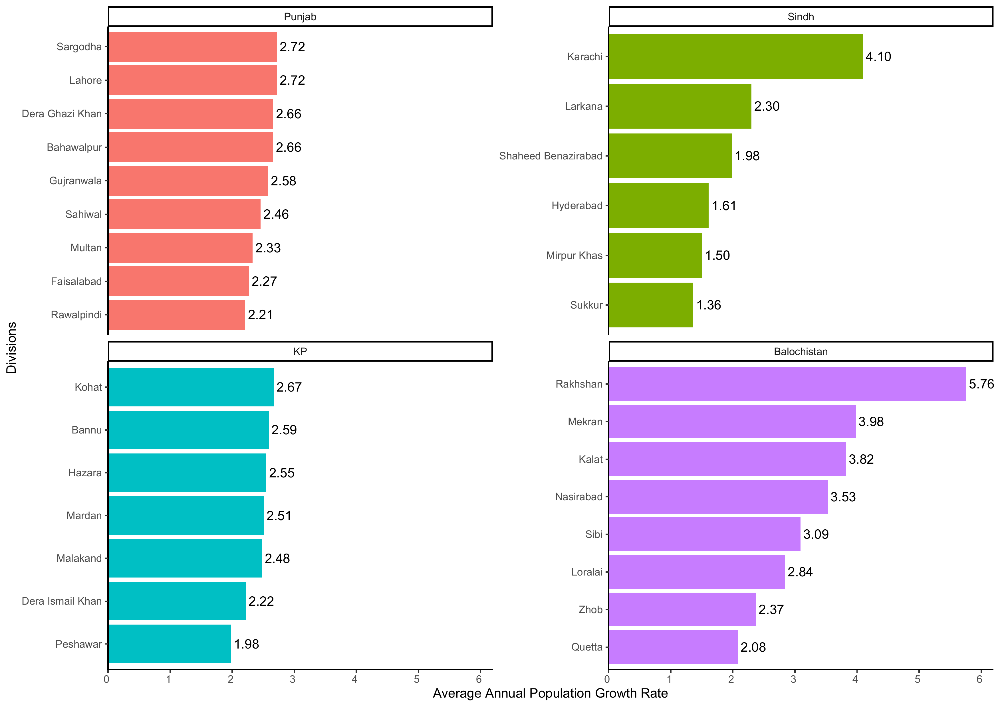
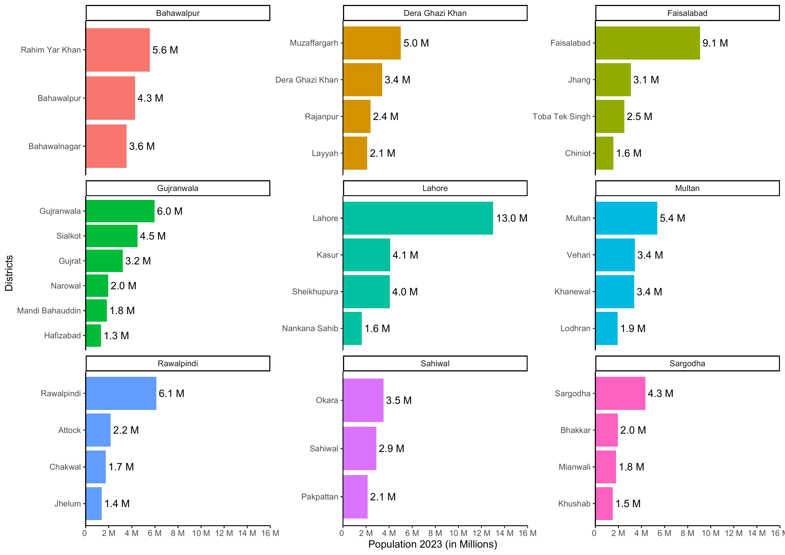
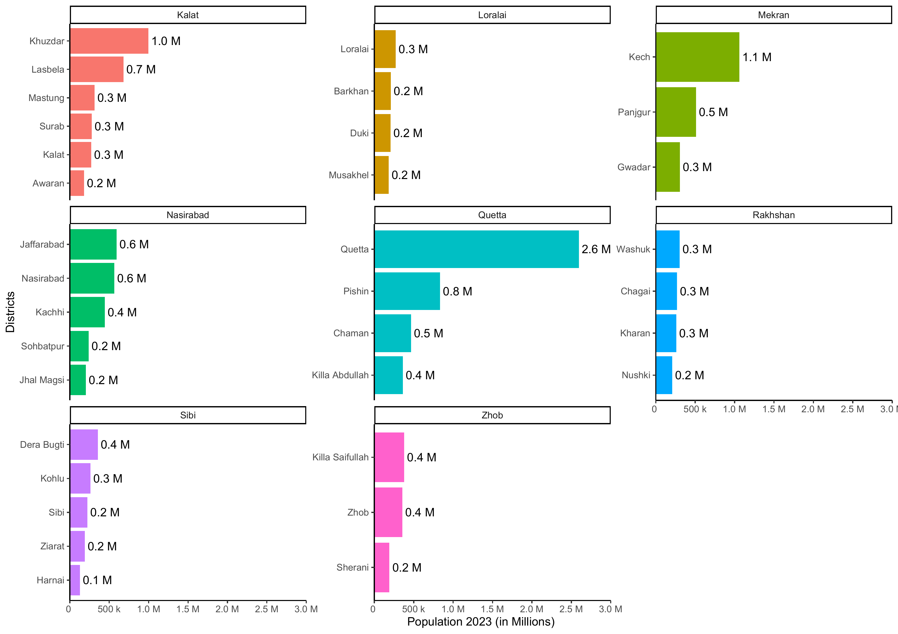
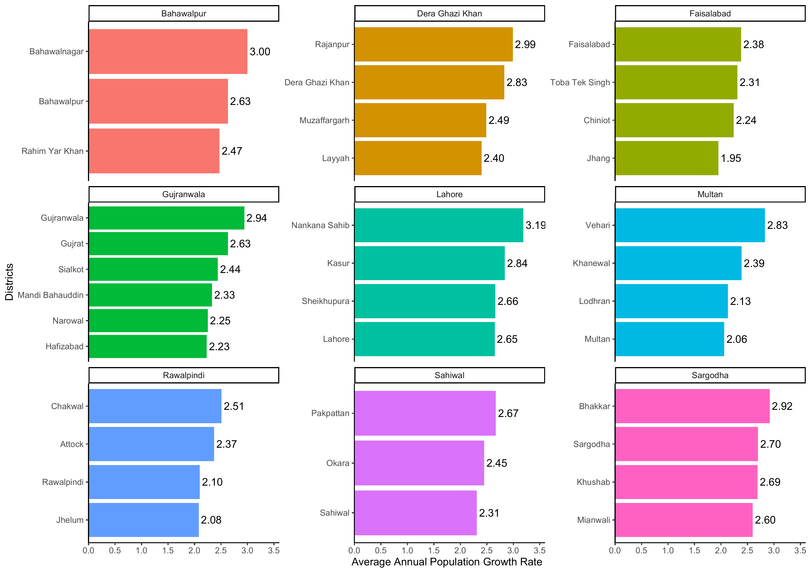
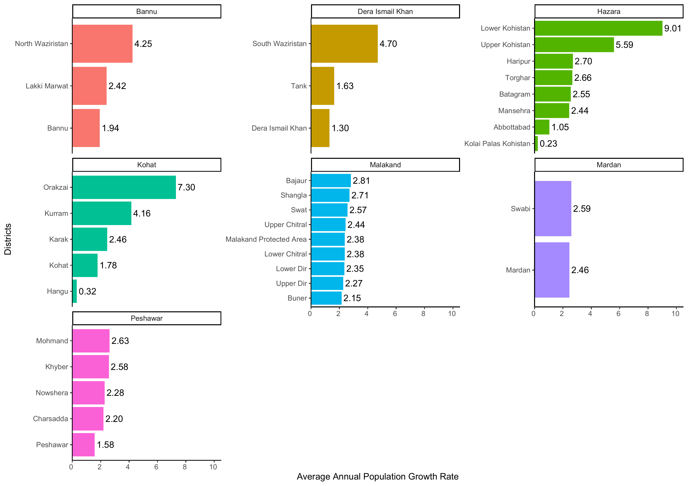

```{r setup, include = FALSE}
knitr::opts_chunk$set(
  collapse   = TRUE
, echo       = FALSE
, fig.width  = 14
, fig.height = 10
, out.width  = "100%"
, comment    = "#>"
)
```

# Introduction

The [PakPC2023](https://github.com/myaseen208/PakPC2023) package contains data sets and functions for [Pakistan Population Census 2023](https://www.pbs.gov.pk/).


## Province Level

```{r, results = 'asis'}
library(PakPC2023)
# library(gt)
# PakPC2023Pak %>% 
#   gt() %>% 
#   fmt_number(columns = c(Households, Pop2023 , Pop2017), suffixing = TRUE)
library(DT)
datatable(
  data  = PakPC2023Pak
, caption = htmltools::tags$caption(
                style = 'caption-side: top; text-align: center;',
                'Table 1: ', htmltools::em('Number of households, Population & Average Annual Population Growth Rate by Region & Area')
                )
 ) %>% 
 formatCurrency(
      columns  = c('Households', 'Pop2023', 'Pop2017')
    , currency = ""
    , interval = 3
    , mark     = ","
    , digits   = 0
    ) %>% 
 formatCurrency(
      columns  = c('AHS', 'GR')
    , currency = ""
    , digits   = 2
    )
```

<br>
<br>

```{r, fig.cap = "Fig. 1: Population by Regions"}
knitr::include_graphics("./images/Plot1.png")
```

<br>
<br>

```{r, fig.cap = "Fig. 2: Population by Regions & Area"}

```


<br>
<br>

```{r, fig.cap = "Fig. 3: Average Annual Population Growth Rate by Regions"}
knitr::include_graphics("./images/Plot11.png")
```


<br>
<br>

```{r, fig.cap = "Fig. 4: Average Annual Population Growth Rate by Regions & Area"}

```


## Division Level


```{r, results = 'asis'}
datatable(
  data  = PakPC2023PakDiv
, caption = htmltools::tags$caption(
                style = 'caption-side: top; text-align: center;',
                'Table 2: ', htmltools::em('Number of households, Population & Average Annual Population Growth Rate by Region & Division')
                )
 ) %>% 
 formatCurrency(
      columns  = c('Households', 'Pop2023', 'Pop2017')
    , currency = ""
    , interval = 3
    , mark     = ","
    , digits   = 0
    ) %>% 
 formatCurrency(
      columns  = c('AHS', 'GR')
    , currency = ""
    , digits   = 2
    )
```

<br>
<br>

```{r, fig.cap = "Fig. 5: Population by Regions & Division"}

```

<br>
<br>

```{r, fig.cap = "Fig. 6: Average Annual Population Growth Rate by Regions & Division"}

```


## District Level


```{r, results = 'asis'}
datatable(
  data  = PakPC2023PakDist
, caption = htmltools::tags$caption(
                style = 'caption-side: top; text-align: center;',
                'Table 3: ', htmltools::em('Number of households, Population & Average Annual Population Growth Rate by Region & District')
                )
 ) %>% 
 formatCurrency(
      columns  = c('Households', 'Pop2023', 'Pop2017')
    , currency = ""
    , interval = 3
    , mark     = ","
    , digits   = 0
    ) %>% 
 formatCurrency(
      columns  = c('AHS', 'GR')
    , currency = ""
    , digits   = 2
    )
```

<br>
<br>

```{r, fig.cap = "Fig. 7: Population by Division & District for Punjab"}

```

<br>
<br>


```{r, fig.cap = "Fig. 8: Population by Division & District for Sindh"}

```

<br>
<br>


```{r, fig.cap = "Fig. 9: Population by Division & District for KP"}

```

<br>
<br>


```{r, fig.cap = "Fig. 10: Population by Division & District for Balochistan"}

```

<br>
<br>


```{r, fig.cap = "Fig. 11: Average Annual Population Growth Rate by Division & District for Punjab"}

```


<br>
<br>


```{r, fig.cap = "Fig. 12: Average Annual Population Growth Rate by Division & District for Sindh"}

```


<br>
<br>


```{r, fig.cap = "Fig. 13: Average Annual Population Growth Rate by Division & District for KP"}

```


<br>
<br>


```{r, fig.cap = "Fig. 14: Average Annual Population Growth Rate by Division & District for Balochistan"}
knitr::include_graphics("./images/Plot17.png")
```


