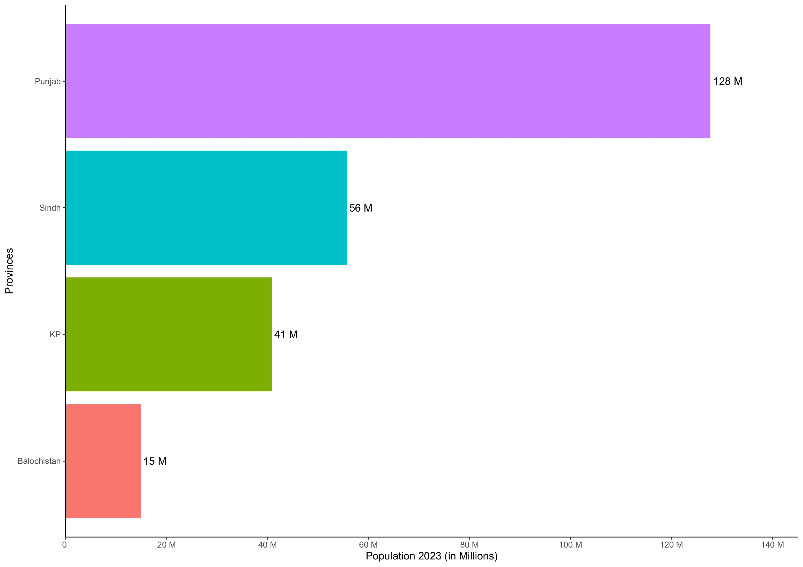
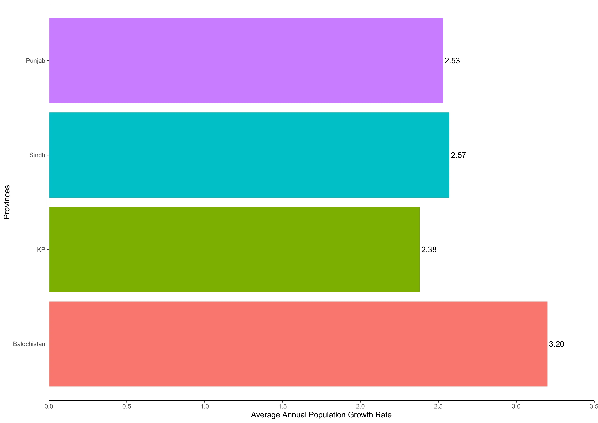

```{r setup, include = FALSE}
knitr::opts_chunk$set(
  collapse   = TRUE
, echo       = FALSE
, fig.width  = 14
, fig.height = 10
, out.width  = "100%"
, comment    = "#>"
)
```

# Introduction

The [Pakistan Bureau of Statistics (PBS)](https://www.pbs.gov.pk/)  holds the pivotal responsibility of orchestrating, collating, and disseminating the outcomes of the population census within the nation. On the significant date of August 5, 2023, the Council of Common Interests (CCI) accorded its approval for the findings derived from the Census of 2023, a comprehensive endeavor led by the PBS to capture the demographic landscape of Pakistan. To facilitate widespread access to this crucial data, the PBS published the conclusive results of the Census 2023 on its [official website](https://www.pbs.gov.pk/) in a PDF format, albeit one that is not machine-readable.

However, this presentation in PDF form poses a significant challenge to researchers and analysts aiming to delve into the insights embedded within this valuable data. The intricacies of extracting, processing, and interpreting information from a non-machine-readable format like PDF hinder the swift utilization of this data for in-depth analysis. Recognizing this impediment, a strategic solution has been crafted in the form of an R programming language package termed [PakPC2023](https://github.com/myaseen208/PakPC2023).

The [PakPC2023](https://github.com/myaseen208/PakPC2023) R package has been meticulously developed to surmount the obstacles presented by the non-machine-readable PDF format. This specialized software acts as a bridge, effectively converting the cumbersome PDF-based Census 2023 data into a format that is amenable for analysis within the R software environment. Researchers, analysts, and data enthusiasts can seamlessly install the [PakPC2023](https://github.com/myaseen208/PakPC2023) package from the Comprehensive R Archive Network (CRAN), a repository that serves as a hub for R packages, ensuring easy accessibility to this innovative tool.

By implementing the [PakPC2023](https://github.com/myaseen208/PakPC2023) package, the door is opened for researchers to harness the power of the Census 2023 data in an efficient and effective manner. This strategic initiative not only streamlines the process of accessing and utilizing the census data but also empowers researchers to unlock valuable insights and trends that lie within, contributing to informed decision-making and comprehensive socio-economic understanding.


## Province Level

```{r, results = 'asis'}
library(PakPC2023)
# library(gt)
# PakPC2023Pak %>% 
#   gt() %>% 
#   fmt_number(columns = c(Households, Pop2023 , Pop2017), suffixing = TRUE)
library(DT)
datatable(
  data  = PakPC2023Pak
, caption = htmltools::tags$caption(
                style = 'caption-side: top; text-align: center;',
                'Table 1: ', htmltools::em('Number of households, Population & Average Annual Population Growth Rate by Region & Area')
                )
 ) %>% 
 formatCurrency(
      columns  = c('Households', 'Pop2023', 'Pop2017')
    , currency = ""
    , interval = 3
    , mark     = ","
    , digits   = 0
    ) %>% 
 formatCurrency(
      columns  = c('AHS', 'GR')
    , currency = ""
    , digits   = 2
    )
```


The visual representation presented in Figure \@ref(fig:Fig1) provides a comprehensive overview of the population distribution across various regions of Pakistan. This data has been meticulously collected from the Pakistan Population Census of 2023, serving as an accurate reflection of the demographic landscape of the country.

A closer examination of the graph reveals that the province of Punjab emerges as the most populous region, boasting an impressive population count of approximately 128 million individuals. Following closely, the province of Sindh contributes significantly to the nation's population with approximately 56 million residents.

Turning our attention towards the remaining regions, Khyber Pakhtunkhwa stands as a substantial population center with around 41 million inhabitants, further emphasizing its role in the overall demographic makeup of Pakistan. On the other hand, Balochistan, while having a comparably smaller population, still contributes notably with around 15 million people.

It is noteworthy that the data showcased in Figure \@ref(fig:Fig1) not only underscores the population sizes of these regions but also underscores the diversity and complexity of Pakistan's demographic distribution. This information serves as a valuable resource for policymakers, researchers, and anyone interested in gaining insights into the population dynamics of Pakistan.


<br>

```{r Fig1, fig.cap = "Population by Regions"}

```

<br>
<br>

Figure \@ref(fig:Fig2) illustrates the distribution of Pakistan's population across various regions and areas, providing insights drawn from the Pakistan Population Census 2023. The data underscores a significant urban-rural divide within the country, shedding light on the demographic landscape.

Notably, the data reveals that a substantial portion of Pakistan's population resides in rural areas, accounting for a staggering figure of more than 147.75 million individuals. In contrast, the urban population stands at slightly over 93.75 million. This distribution underscores the predominance of rural living conditions in Pakistan.

Examining the regional disparities, the province of Punjab emerges as the leader in terms of rural population, boasting an impressive count of over 75.71 million inhabitants in rural settings. Sindh, on the other hand, leads the pack in urban population, hosting a significant urban community of over 29.92 million individuals.

p("The visualization takes the form of a multiple bar chart, with distinctive colors assigned to each region for clarity. The y-axis of the chart is scaled to represent the total population in millions, providing a clear sense of the demographic distribution.")

p("The data presented within Figure \@ref(fig:Fig2) serves to accentuate the pronounced urban-rural divide prevalent within Pakistan. The statistics reaffirm the prevalence of rural living conditions, with Punjab standing out as the province with the highest rural population, surpassing the 75.71 million mark. The second spot in terms of rural population is claimed by Sindh, hosting more than 25.77 million residents in rural areas. In contrast, Balochistan registers as the province with the lowest rural population, counting slightly over 4.61 million individuals.")

p("Shifting the focus to urban populations, Punjab once again takes the lead, this time in the urban category, as it accommodates a substantial urban populace exceeding 52.00 million. Sindh follows closely, contributing to the urban landscape with over 29.90 million inhabitants. In stark contrast, Khyber Pakhtunkhwa and Balochistan exhibit the smallest urban populations, each recording figures slightly surpassing 6.10 million and 4.60 million individuals, respectively.")

p("In conclusion, Figure \@ref(fig:Fig2) casts a spotlight on the demographic distribution within Pakistan, drawing attention to the prevailing urban-rural divide. The robust presentation of data underscores the dominance of rural populations, particularly in provinces like Punjab and Sindh, while also providing valuable insights into the urban landscape across various regions of the country.")


<br>
<br>


```{r Fig2, fig.cap = "Population by Regions & Area"}
knitr::include_graphics("./images/Plot2.webp")
```


<br>
<br>

```{r, fig.cap = "Fig. 3: Average Annual Population Growth Rate by Regions"}

```


<br>
<br>

```{r, fig.cap = "Fig. 4: Average Annual Population Growth Rate by Regions & Area"}

```


## Division Level


```{r, results = 'asis'}
datatable(
  data  = PakPC2023PakDiv
, caption = htmltools::tags$caption(
                style = 'caption-side: top; text-align: center;',
                'Table 2: ', htmltools::em('Number of households, Population & Average Annual Population Growth Rate by Region & Division')
                )
 ) %>% 
 formatCurrency(
      columns  = c('Households', 'Pop2023', 'Pop2017')
    , currency = ""
    , interval = 3
    , mark     = ","
    , digits   = 0
    ) %>% 
 formatCurrency(
      columns  = c('AHS', 'GR')
    , currency = ""
    , digits   = 2
    )
```

<br>
<br>

```{r, fig.cap = "Fig. 5: Population by Regions & Division"}
knitr::include_graphics("./images/Plot3.webp")
```

<br>
<br>

```{r, fig.cap = "Fig. 6: Average Annual Population Growth Rate by Regions & Division"}
knitr::include_graphics("./images/Plot13.webp")
```


## District Level


```{r, results = 'asis'}
datatable(
  data  = PakPC2023PakDist
, caption = htmltools::tags$caption(
                style = 'caption-side: top; text-align: center;',
                'Table 3: ', htmltools::em('Number of households, Population & Average Annual Population Growth Rate by Region & District')
                )
 ) %>% 
 formatCurrency(
      columns  = c('Households', 'Pop2023', 'Pop2017')
    , currency = ""
    , interval = 3
    , mark     = ","
    , digits   = 0
    ) %>% 
 formatCurrency(
      columns  = c('AHS', 'GR')
    , currency = ""
    , digits   = 2
    )
```

<br>
<br>

```{r, fig.cap = "Fig. 7: Population by Division & District for Punjab"}
knitr::include_graphics("./images/Plot4.webp")
```

<br>
<br>


```{r, fig.cap = "Fig. 8: Population by Division & District for Sindh"}

```

<br>
<br>


```{r, fig.cap = "Fig. 9: Population by Division & District for KP"}

```

<br>
<br>


```{r, fig.cap = "Fig. 10: Population by Division & District for Balochistan"}

```

<br>
<br>


```{r, fig.cap = "Fig. 11: Average Annual Population Growth Rate by Division & District for Punjab"}
knitr::include_graphics("./images/Plot14.webp")
```


<br>
<br>


```{r, fig.cap = "Fig. 12: Average Annual Population Growth Rate by Division & District for Sindh"}
knitr::include_graphics("./images/Plot15.webp")
```


<br>
<br>


```{r, fig.cap = "Fig. 13: Average Annual Population Growth Rate by Division & District for KP"}

```


<br>
<br>


```{r, fig.cap = "Fig. 14: Average Annual Population Growth Rate by Division & District for Balochistan"}

```


